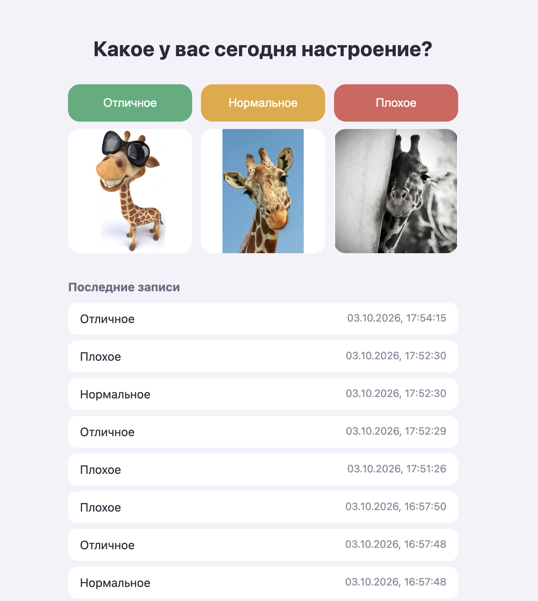

# having-fun
# Трекер настроения

Небольшое приложение: на главной странице вопрос «Какое у вас сегодня настроение?» и три варианта ответа (отличное, нормальное, плохое). Выбор сохраняется в PostgreSQL, ниже показываются последние записи.

## Состав

- **Бэкенд:** Python, FastAPI (`backend/`)
- **Фронтенд:** одна страница `frontend/index.html` и картинки в `frontend/images/`, их отдаёт бэкенд
- **База данных:** PostgreSQL 16 в Docker, отдельный сервис

## Запуск

Нужны: Python 3.10+, Docker Desktop, Git.

1. Склонировать репозиторий и перейти в папку проекта.
2. Создать файл с настройками:
```
   cp .env.example .env
```
3. Поднять базу данных (Docker Desktop должен быть запущен):
```
   docker compose up -d
```
4. Создать виртуальное окружение и установить зависимости:
```
   python3 -m venv venv
   source venv/bin/activate
   pip install -r backend/requirements.txt
```
5. Запустить бэкенд:
```
   cd backend
   python -m uvicorn main:app --reload
```
6. Открыть в браузере http://127.0.0.1:8000

Документация API: http://127.0.0.1:8000/docs

## API

- `POST /api/moods` с телом `{"value": "great" | "ok" | "bad"}` сохраняет настроение
- `GET /api/moods` возвращает последние 20 записей

## Как части общаются

Браузер загружает страницу с бэкенда. Нажатие на кнопку отправляет `fetch`-запрос `POST /api/moods`, бэкенд записывает настроение в PostgreSQL. Затем страница делает `GET /api/moods`, бэкенд читает записи из базы и возвращает их, список на странице обновляется.

База данных слушает порт 5433 на компьютере (внутри контейнера 5432), чтобы не конфликтовать с локально установленным Postgres. Данные хранятся в docker-томе `pgdata` и переживают перезапуск контейнера.

## Скриншот

